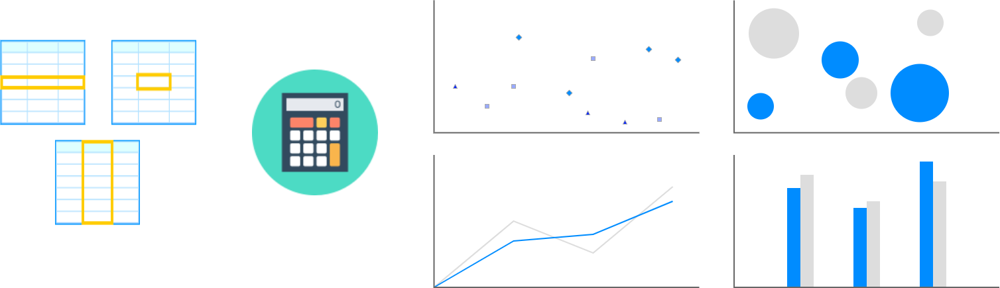

## Data Science as a Workflow for Insight and Automation

```{r 01-slide-image-01, fig.height=2.5, fig.width=2.5, echo=FALSE}
knitr::include_graphics(path = "figs/01-slide-image-01.png")
```


## Introductions: Who are we?


**Martin Frigaard:** Martin is a science and data evangelist providing analytic tools and skills to various audiences including medical professionals, engineers, product managers, and journalists. He received his leadership and team-building experience in the US Army and a non-commissioned officer and has a masters degree in clinical research from the University of California, San Francisco. He's worked with various universities, non-profits, and private companies. 

## Introductions: Who are we?


**Peter Spangler:** Entrepreneurial minded data science leader with experience building analytic solutions, insights and teams at Lyft, Citrix and Alibaba Group. Led experimentation design and data science projects focused on retention, user acquisition and channel optimization in the SaaS and rideshare spaces. I have produced solutions for incrementality testing, segmentation, ML models and fraud. I am a passionate advocate for building analytics teams in cross-functional environments and believe communication is core to any analytics program.

## Agenda 

- "***Computation Is Not Decision Making***"

  + We need to ask the right questions of our data for our models to add the most business value
  
- "***Visualization is our most powerful tool***"

  + We can surface actionable insights and areas of greatest impact by exploring relationships in our data
  
- "***Sizing supports our stakeholders***"

  + Uncovering the drivers of our business problem will inform necessary partnerships for action
  
## Computation Is Not Decision Making (1)

### Improving business decisions

<div style="color:red;margin:20px;margin-top:50px;" >

Using data effectively requires <b>both data and domain knowledge</b> (one will not suffice).

</div>


<p style="margin:10px;font-size:70%;">
<i> -- click "S" to view speaker notes </i> 
</p>

<aside class="notes">

It's assumed that you know about your products/services, the competition, and your customers. In order to use data to improve decision-making, you'll need to understand how to properly leverage what you already know about a topic (i.e. the domain knowledge). Computers can run models, but they can't tell you what's important.

The key to using data successfully is 1) finding the right data and 2) knowing what attributes are important to your business.

If the right data are being measured, and we can clearly define the problem, then data science can help.

</aside>

## Computation Is Not Decision Making (2)

### Set the stage 

<div style="color:blue;margin:20px;margin-top:50px;" >

Be able to articulate, <b>“what problem are we facing?”</b>

</div>

<p style="margin:10px;font-size:70%;">
<i> -- click "S" to view speaker notes </i> 
</p>

<aside class="notes">

What decision needs to be made? What problem needs to be figured out? What numbers need to be calculated?  What is the "main thing"? Is it to reduce acquisition costs, increasing engagement, etc.? Remember, the main thing is to keep the main thing the main thing.

</aside>

## Computation Is Not Decision Making (3)

### Know the characters in the story

<div style="color:red;margin:20px;margin-top:50px;" >

Understand what's been measured, i.e. <b>“what are the data?”</b>

</div>

<p style="margin:10px;font-size:70%;">
<i> -- click "S" to view speaker notes </i> 
</p>

<aside class="notes">

What have we measured? What still needs to be measured? What can we do with the data we have? What new data will we need when we've used everything we have?

Are you looking for answers based on the data you have, or based on the problem/question? It is possible that the important question you’re facing can’t be answered with the data you have (this just means the new problem becomes, "how to collect the data you need?")

</aside>


## Computation Is Not Decision Making (4)

### Connect the business problem to a measurable objective

<div style="color:blue;margin:20px;margin-top:50px;" >

The hardest part of data science is translating a problem into a question that data can answer (and then finding those data).

Example measurable objective: <b>“Identify predictors for customer churn.”</b>

</div>

<p style="margin:10px;font-size:70%;">
<i> -- click "S" to view speaker notes </i> 
</p>

<aside class="notes">

Other examples: 

Did our recent marketing campaign improve customer engagement?  
Have this customer’s buying patterns changed? If so, how?  
How does the location of our products affect purchasing behaviors?  
Who should we target with our new product/service?  

The hardest part of using data to solve problems is asking questions in a way that a computer can answer them. We need to ask the question in a way where we can leverage the power of computation--this means fitting our objectives into a series of steps that a computer can execute.

</aside>

## Visualizing the process

<div style="color:red;margin:20px;margin-top:50px;" >
***Step 1: Look at your data***
</div>


<aside class="notes">

Before making any calculations, creating any charts, or running any models, make sure you’ve taken the time to look at the raw data. Open it in a spreadsheet, look at the columns and rows. This will give you a mental model going forward of what you’re dealing with. 

</aside>


## Visualizing the process

<div style="color:green;margin:20px;margin-top:50px;" >
*Step 1: Look at your data*
</div>

<div style="color:red;margin:20px;margin-top:50px;" >
***Step 2: Get some numbers***
</div>


<aside class="notes">

The second step is to calculate some summary statistics about these data. Means, medians, standard deviations, minimums, maximums, etc. These give us something to think about and equips us with some language for describing the measurements (i.e. “our average customer tenure is…”).

</aside>


## Visualizing the process

<div style="color:green;margin:20px;margin-top:50px;" >
*Step 1: Look at your data*
</div>

<div style="color:green;margin:20px;margin-top:50px;" >
*Step 2: Get some numbers*
</div>

<div style="color:red;margin:20px;margin-top:50px;" >
***Step 3: Make a graph***
</div>



<aside class="notes">

The third step is to create visualizations for the data. This is the most important step, because visualization is an essentially human activity. A computer can’t interpret a graph, or be surprised by it. Pictures and images are how humans make sense of complex systems. Data are too complicated to be understood as bits of information in a spreadsheet--leave that to the computer. Get comfortable exploring the relationships between measurements using data visualizations.

</aside>

